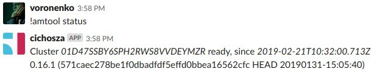
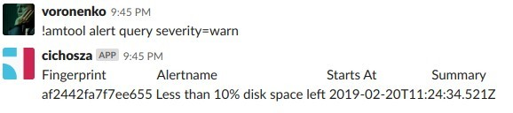
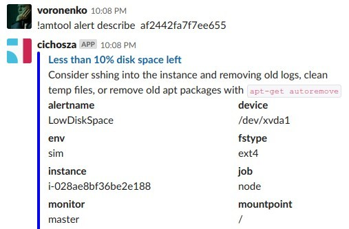
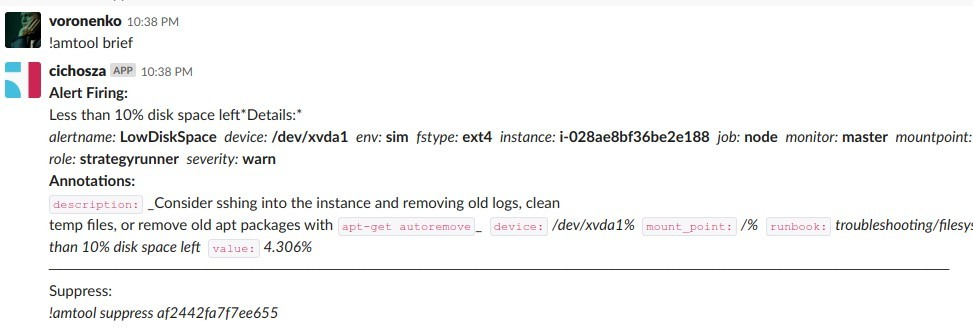

Prometheus Alert Manager plugin for Errbot
==========================================

Member of `sa-cichosza` family

Chatops features for Prometheus Alert Manager
---------------------------------------------

This plugin allows you to work with prometheus alerts for your team in a Slack channel.
 More information about Errbot <http://errbot.io>.

Quickstart
----------

First you need to install Errbot, you can follow this documentation http://errbot.io/en/latest/user_guide/setup.html.
Errbot server can be installed with https://github.com/softasap/sa-chatops-errbot ansible role or manually

Then you'll need to install this plugin on your Errbot instance doing 
```
!repos install https://github.com/Voronenko/errbot-prometheus-alertmanager
```
, you can do that by talking to your bot locally with `errbot -T`. 

Initially, you need also to let bot know how to connect to your prometheus alertmanager instance,
providing alert manager address and timezone for time values.

```

!plugin config SaAmtool {'server_address': 'http://10.9.0.138:9093/api/v2', 'time_zone': 'Europe/Kiev'}
```

Once everything is setup, you can connect your bot to your Slack channel following this documentation http://errbot.io/en/latest/user_guide/configuration/slack.html.

Bot commands
------------
## Endpoint status !amtool status

With `!amtool status` you can check, if alert manager responds




## Quering alerts !amtool alert query

Using the `!amtool alert query` command, you can list all alerts that have been send 
to Alertmanager:

```
!amtool alert query

Alertname     Starts At                Summary
EndpointDown  2018-04-03 08:48:47 UTC  Endpoint http://localhost:8080 down

```

You can also filter alerts by their labels using the appropriate matcher. 
A matcher contains the label name, the appropriate operation, which can be = 
for full matching and =~ for partial matching, and the label's value.

If you want to list all alerts that have a critical severity label attached, 
use the severity=critical matcher in the alert query command:

```
!amtool alert query severity=critical
```
Like before, the output contains the alert's name, the time of alert's first occurrence and the alert's summary.

Output
```
Alertname     Starts At                Summary
EndpointDown  2018-04-03 08:48:47 UTC  Endpoint http://localhost:8080 down
```



You can use regular expressions to match labels with the =~ operator. 
For example, to list all alerts for http://localhost endpoints not depending on the port, 
you can use the instance=~http://localhost.* matcher:

```
!amtool alert query instance=~http://localhost.*
```

## Geting alert details by fingerprint !amtool alert describe <fingerprint>

Gets more detailed info about alert from prometheus



## Muting alerts with !amtool silence add

Now let's look at how to silence alerts using `amtool`.

Silencing alerts lets you mute alerts based on the matcher for a given time. 
During that period, you'll not receive any email or Slack notification for the silenced alert.

The `!amtool silence add` command takes the matcher as an argument and creates a new silence 
based on the matcher.

To define the expiration of an alert, use the `--expires` flag with desired duration of the silence,
such as 1h or the --expire-on flag with the time of silence expiration in the RFC3339 format. 
For example, the format `2019-10-04T07:50:00+00:00` represents `07.50am` on October 4th, 2019.

If the `--expires` or the `--expires-on` flag is not provided, 
alerts will be silenced for 1 hour.

To silence all alerts for the `http://localhost:8080` instance for `3` hours, 
you'd use the following command:

`!amtool silence add  instance=http://localhost:8080 --expires 3h` 

The output contains an identification number for the silence, so make sure to note it down
as you'll need it in case you want to remove the silence:

Output
```
4e89b15b-0814-41d3-8b74-16c513611732
```

If you want to provide additional information when creating the silence, 
such as the author and comments, use the `--author` and `--comment` flags:

`!amtool silence add severity=critical --expires 3h --author "Sammy The Shark" --comment "Investigating the progress"`
Like before, the output contains the ID of the silence:

Output
```
12b7b9e1-f48a-4ceb-bd85-65ac882ceed1
```

## Querying current silences `!amtool silence query` 

The command `!amtool silence query` 
will show the list of all non-expired silences:

```
!amtool silence query`
```

The output contains the ID of the silence, the list of matchers, the expiration timestamp, the author, and a comment:

Output

```
ID                                    Matchers                        Ends At                  Created By       Comment
12b7b9e1-f48a-4ceb-bd85-65ac882ceed1  severity=critical               2018-04-04 08:02:58 UTC  Sammy The Shark  Investigating in the progress
4e89b15b-0814-41d3-8b74-16c513611732  instance=http://localhost:8080  2018-04-04 08:14:21 UTC  sammy
```

Similar to the alert query command, you can use label matchers to filter the output by labels attached on creation:

```
!amtool silence query instance=http://localhost:8080
```
Like before, the output will include the ID number and details of the alert:

Output
```
ID                                    Matchers                        Ends At                  Created By  Comment
4e89b15b-0814-41d3-8b74-16c513611732  instance=http://localhost:8080  2018-04-04 08:14:21 UTC  sammy
```

Finally, to expire a silence, use the `!amtool silence expire` with the ID of the silence
 you want to expire:

```
!amtool silence expire 12b7b9e1-f48a-4ceb-bd85-65ac882ceed1
```

## Deleting silence with !amtool silence expire
```
amtool silence expire 4e89b15b-0814-41d3-8b74-16c513611732
```
No output represents successful command execution. 
If you see an error, make sure you provided the correct ID of the silence.


## Brief for alerts !amtool alerts

This is alternative template , that returns more information about every alert.
Details level: high

```md

For *active* True, *silenced* True, *inhibited* True, *unprocessed* True, *filter* [], *receiver*
Found *3* alerts.

*Alert Firing:*
Less than 10% disk space left;; *4.307%*

Consider sshing into the instance and removing old logs, clean
temp files, or remove old apt packages with `apt-get autoremove`

*Details:*
*alertname:* `LowDiskSpace`  *device:* `/dev/xvda1`  *env:* `sim`  *fstype:* `ext4`  *instance:* `i-028ae8bf36be2e188`  *job:* `node`  *monitor:* `master`  *mountpoint:* `/`  *name:* `SIM host`    *severity:* `warn`
State `active`, inhibited by `[]`, silenced by []
Started `2019-02-20T11:24:34.521Z` , updated  `2019-02-24T21:20:19.524Z`
_!amtool suppress af2442fa7f7ee655_

```

## Brief for alerts !amtool brief

This is alternative template ,  with full list of currently active alerts with moderate details level




Contributing
------------

Contributions to this plugin are always welcome and highly encouraged.

License
-------

MIT - See LICENSE for more information.


Interested in other plugins or roles ?
--------------------------------------

Subscribe for roles updates at [FB] (https://www.facebook.com/SoftAsap/)

Join gitter discussion channel at [Gitter](https://gitter.im/softasap)

Discover other roles at  http://www.softasap.com/roles/registry_generated.html
